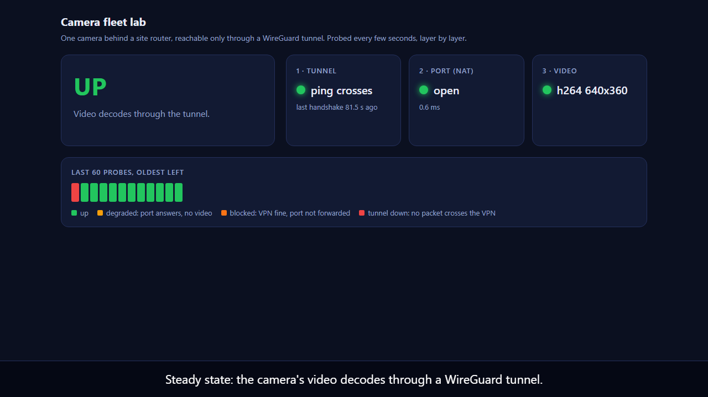
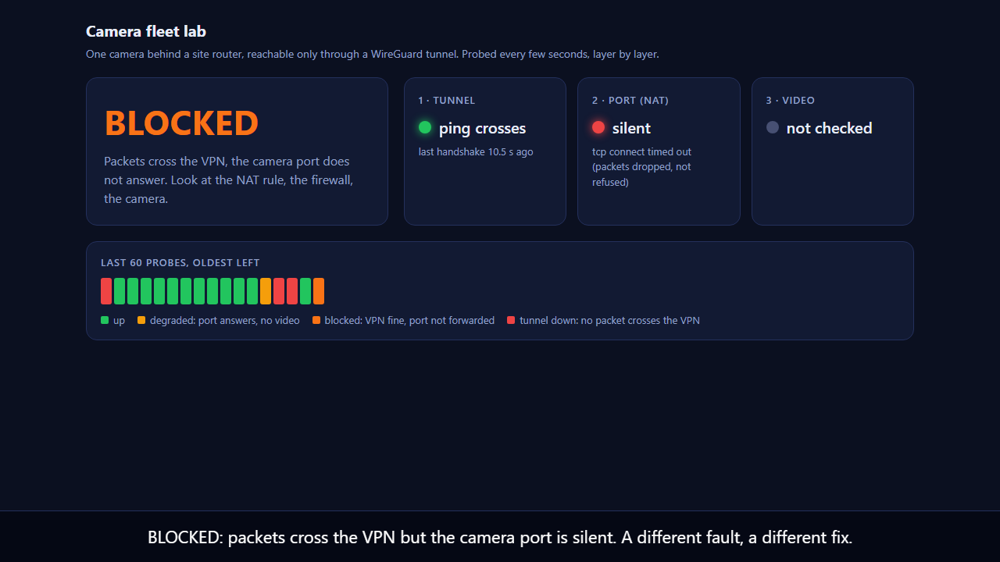

# camera-fleet-lab

A small, runnable model of one problem a camera fleet has: **a device at a remote site, behind a router, that the
platform can only reach through a VPN**, and a monitor that has to tell you *which layer* broke when it goes dark.

Everything runs in Docker on one machine: kernel WireGuard, `iptables` NAT and firewall, an RTSP camera, an async
FastAPI monitor and MariaDB. The networking is real Linux behaviour; the topology is a **model**, not a deployment (see
[Limits](#limits)).



## What it demonstrates

| Area | What is in the lab |
|---|---|
| **Linux networking** | A site router container with WireGuard, `ip_forward`, default-deny `iptables`, **DNAT** from the tunnel address to the camera and **MASQUERADE** on the site side, conntrack-aware rules |
| **VPN** | WireGuard hub (platform) and spoke (site router) with keys generated at start and exchanged over a volume. The site router dials *out* and holds the NAT mapping open with a persistent keepalive, the way a 4G router has to |
| **Firewall** | The camera sits on an `internal` network the hub is not on. The only path is the tunnel, and only TCP 8554 (RTSP) and 8889 (WebRTC page) are forwarded. Everything else is dropped silently |
| **Streaming** | A synthetic H.264 camera (ffmpeg into MediaMTX) served over **RTSP**, probed with `ffprobe`, plus the **WebRTC** page reached through the tunnel |
| **Async Python** | FastAPI. Every probe is async with a hard timeout, subprocesses are killed on timeout, and a test proves the event loop keeps ticking while a probe hangs |
| **Database and pooling** | **MariaDB** through SQLAlchemy 2.0 async with an explicitly configured pool (`pool_size`, `max_overflow`, `pool_pre_ping`, `pool_recycle`) and a `/pool` endpoint so occupancy is observable |
| **Debugging with no docs** | [`DEBUGGING.md`](DEBUGGING.md): two injected faults, the commands used to tell them apart, and the wrong assumption I made and measured my way out of |

## The idea: probe in layers

```
tunnel  ->  port (NAT)  ->  video
```

Each layer fails for a different reason and needs a different fix, so the monitor checks them in order and reports the
first one that fails:

| State | Meaning | Where to look |
|---|---|---|
| `up` | video decodes through the tunnel | nothing |
| `degraded` | the port answers but no video decodes | the camera or its encoder |
| `blocked` | packets cross the VPN, the camera port is silent | the NAT rule, the firewall, the camera being off |
| `tunnel_down` | no packet crosses the VPN at all | WireGuard, keys, endpoint, the 4G link |



## Run it

Needs Docker with a kernel that has WireGuard (Docker Desktop's WSL2 kernel does). From this folder:

```
docker compose up -d --build
python scripts/verify.py          # 16 end-to-end checks, injects both faults, exit 0 only if all pass
open http://127.0.0.1:8100/       # the live dashboard
python scripts/measure_recovery.py 40     # block the VPN for 40 s and time the recovery
cd hub && pip install -r requirements.txt && pytest      # offline unit tests, no Docker needed
```

Short captioned screen recording of both faults: [`docs/demo.mp4`](docs/demo.mp4).

## Measured results

From `docs/last_run.json` (one run on one machine, so read them as orders of magnitude, not benchmarks):

| Check | Result |
|---|---|
| Camera reachable only through the tunnel (no direct route from the hub) | pass |
| Stream decodes through the tunnel | h264 640x360 |
| Non-forwarded port on the site router | silently dropped |
| **Fault A**: WireGuard UDP blocked | detected as `tunnel_down` after **4 s and 13 s** in two runs (it depends where in the 5 s probe cycle the block lands, and whether the first symptom is a stalled stream that reads `degraded` for one cycle), recovered by itself **6 to 7 s** after unblocking |
| **Fault B**: DNAT rule removed (tunnel healthy) | detected as `blocked` after **8 s** in both runs, recovered **8 s** after the rule was restored |
| A 40 s VPN block, then unblocked | fresh handshake on both ends within **about 5 s** |
| No-fault soak, about 5.5 minutes (`scripts/soak_summary.py`) | 43 probes, every one `up`; the handshake age climbed to 118 s and reset twice (two WireGuard rekeys). The first version's 30 s threshold would have called most of this "down" |

`verify.py`: **16/16** checks. `pytest`: 22 passed, 1 skipped (the skip is OS-specific, see below).

## What I got wrong (and how the lab showed me)

These are real, and each one is now pinned by a test or a check.

1. **I assumed persistent keepalive refreshes the WireGuard handshake. It doesn't.** My first version called the tunnel
   "stale" when the last handshake was older than 30 s. The probe history showed `state=down` with
   `tcp=True rtsp=True`, a working camera reported dead, flapping every couple of minutes. Persistent keepalive only holds
   the NAT mapping open; WireGuard re-handshakes about every 120 s and a session lives up to 180 s, so a *healthy*
   tunnel's handshake age cycles from 0 to roughly 3 minutes. The monitor now decides whether the tunnel works by sending
   a packet through it (a ping), and reports the handshake age as information only. Regression test:
   `test_a_healthy_tunnel_with_an_old_handshake_is_still_up`.
2. **My monitor logged nothing.** uvicorn only configures its own loggers, so the app logger's `INFO` lines were silently
   dropped. I only noticed because I went to read them. Fixed with an explicit `logging.basicConfig`.
3. **`asyncmy` has no Python 3.13 wheel and its compile fails**, so the image would not build. Switched to the pure-Python
   `aiomysql`.
4. **SQLAlchemy's pool pre-ping crashed on startup** with that driver pair (`ping() missing 1 required positional argument`).
   Fixed by moving to a newer SQLAlchemy 2.0.
5. **The first end-to-end run failed 4 of 15 checks.** Two were my test or image bugs (the hub image had no `ping`, the
   WebRTC page answers `302` before `200`) and two came from the wrong model in item 1 (the recovery check and the
   "tunnel still fresh" check).
6. **A closed-port unit test passed on Linux and failed on Windows**, because Windows keeps retrying SYNs to a closed local
   port for about 2 s so it looks like a timeout. The test is skipped on Windows with the reason written next to it.

## Layout

```
docker-compose.yml        the four containers and three networks
camera/mediamtx.yml       the stand-in camera (RTSP + WebRTC, ffmpeg test pattern)
edge/                     the site router: WireGuard, iptables NAT + firewall
hub/app/                  FastAPI monitor: probe.py (layers), db.py (pool), main.py (API), dashboard.html
hub/tests/                offline tests for the probe layer
scripts/verify.py         end-to-end proof, both faults
scripts/measure_recovery.py, history_transitions.py, capture_debugging.py
demo/record.mjs           Playwright recording of the dashboard through both faults
docs/                     last_run.json, debugging_capture.txt, screenshots, demo.mp4
```

## Limits

- **It is a lab on one machine.** Docker networks stand in for the internet, the site LAN and a 4G link. There is no real
  carrier-grade NAT, packet loss, MTU black hole or radio behaviour, and no real router firmware.
- **The camera is synthetic** (ffmpeg's test pattern into MediaMTX). There is no ONVIF discovery and no vendor camera
  (Hikvision, Dahua, Uniview) behavior here.
- **One camera and one site.** The monitor models a single device; a fleet needs a camera registry, per-site peers and
  scheduling, none of which is built.
- The credentials in `docker-compose.yml` are lab-only values for a database that is only reachable on an internal
  network, not secrets.
